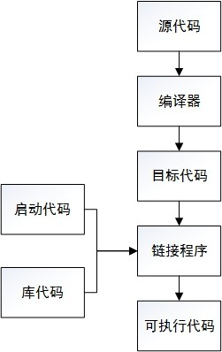
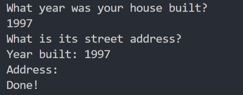
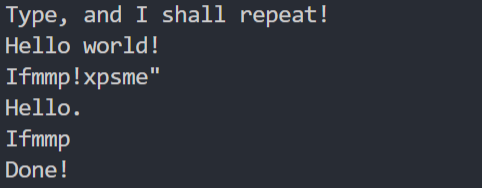
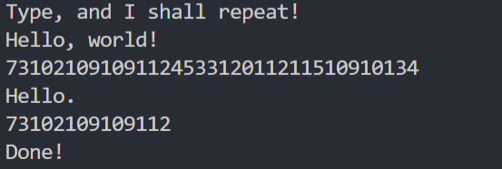

## 第一章: 预备知识

- 编译步骤：

		

		如果程序违反了语言规则，编译器将会生成错误信息。
		但是，有时，真正的问题可能在标识之前；
		有时，一个错误可能引发一连串的错误消息。
		
		所以，改正错误时，先改正第一个错误；
		如果找不到错误，请查看前一行；
<!-- more -->
- 一个技巧
IDE 通过辅助窗口运行程序，程序运行完毕后，有些 IDE 会关闭改窗口，导致难以看出程序输出。因此，我们可以在程序的最后加上这些代码：
``` c++
	cin.get(); // add this statement
	cin.get(); // and maybe this, too
	return 0;
}
```
如果程序在常规输入下后留下一个没有被处理的键击，则第二个语句是必须的。
例如：如果要输入一个数字，则需要输入该数字，然后按 Enter 键。程序将读取该数字，但 Enter 键不被处理，这样它将被第一个 `cin.get()` 读取。

## 第二章： 开始学习 C++ 
- 一些知识点
    - C++ 可以使用 printf()、 scanf()和其他所有标准 C 输入和输出函数，只需要包含常规 C 语言的 stdio.h 文件。
    - 所有的语句都以分号结束，因此在写代码的时候，不要省略分号。
    - `main()` 函数是程序的入口，被启动代码调用，而启动代码是由编译器添加到主程序中的，是程序和操作系统之间的桥梁。事实上，该函数描述的是 main() 和操作系统之间的接口。
    - `void main()` 不是当前标准强制的一个选项，因此在有些系统上不能工作。
    - 如果编译器执行到函数末尾也没有遇到返回语句，则认为 main() 以如下语句结尾：
        `retrun 0;`
        该条隐含的返回语句只适用于main()函数，而不适用于其他函数。
    - `#include<iostream>` 该编译指令将预处理器将 iostream 文件的内容添加到程序中。原始的文件没有被修改，而是将源代码问价和 iostream 组合成一个复合文件，编译的下一个阶段将会使用该文件。

    - `using namespace std;` using 编译指令使用 std 的命名空间，这样便不用 std::cout 而直接使用 cout 即可。
    - `cout` 是一个对象，它的类在 iostream 文件中定义， `<<` 表示该语句将把字符串发送给 cout ；该符号指出了信息流动的路径。（`<<`也可是代表位运算符号，这是一个运算符重载的列子）
    - main() 函数中的`return 0;` 并不是返回给程序的其他部分的，而是返回给操作系统的。

## 第三章： 处理数据

- 知识点
    - 使用 `&` 运算符来检索某一个变量的内存地址
    - 定义变量不可以使用 `-` 连字符，会被编译器解释成减号，例如：
        `int honk-tonk; // invalid -- no hyphens allowed`
    - C++ 基本类型（按宽度递增）： `char` `short` `int` `long` 还有 C++11 新增的`long long`，其中每种类型都有有符号版本和无符号版本，因此总共有 10 种类型可以选择。
    - 对类型名（如 int ）使用`sizeof`运算符时，应将名称放在括号中；但对变量名（如 n_short ）使用该运算符，括号是可选的：
    ```cout << "int is " << size (int) << " bytes.";
       cout << "short is " <<sizeof n_short << " bytes.";```

    - 头文件`climits`定义了符号常量来表示类型的限制。例如`INT_MAX`表示类型`int`能够存储的最大值。
    - 如果不对函数内部定义的变量进行初始化，该变量的值是不确定的。这意味着该变量的值将是它被创建之前，相应内存单元保存的值。
    - C++11 使得可将大括号初始化器用于任何类型。
    - 关键字`unsigned`用于声明无符号版本的基本整型。
    `unsigned int rovert; // unsigned int type`
    - 浮点类型可以表示小数值以及比整型能够表示的值大得多的值。三种浮点类型分别是`float`、`double` 和 `long double`。
    - 对变量赋值、在运算符中使用不同类型、使用强制类型装换时， C++ 将把值从一种类型转化为另外一种类型。大多数情况下的转换是“安全的”。

## 第四章：复合类型

- 数组
    - 数组之所以被称为复合类型，是因为它是使用其他类型来创建的。所以，在语句`float loans[20];`中，`loans`的类型不是数组，而是`float 数组`
    - 数组只有在定义的时候可以初始化，也不能将一个数组赋给另外一个数组。但是可以把一个 string 对象赋值给另一个 string 对象。
- 字符串
    - 字符串又称字符串常量或者字符串字面量，它长这个样子：

            char bird[11] = "Mr. Cheeps";
            char fish[] = "Bubbles";
    - C++ 对字符串长度没有限制。
    - 使用字符数组总存在目标数组过小，无法存储指定信息的危险。例如使用 strcat() 函数的时候。

    - 字符串常量(使用双引号)不能喝字符常量(使用单引号)互换。
            
            char shirt_size = 'S'; // 将 S 的 ASCII 码 83 赋值给 shirt_size 
            char shirt_size = "S"; // 将 S 的内存地址赋值给 shirt_size
    - 标准头文件 `<cstring>` 提供了字符串相关函数的声明。头文件`<string>`提供了 string 类。
    - `getline()`函数每次读取一行，它通过换行符来确定行尾，但不保存换行符；`get()`函数也是用来读取一行的输入，不过读取到行尾时，并不再读取并丢弃换行符，而是将其留在输入队列中。
    ``` C++
    #include <iostream>
    int main()
    {
      using namespace std;
      cout << "What year was your house built?\n";
      int year;
      cin >> year;
      cout << "What is its street address?\n";
      char address[80];
      cin.getline(address, 80);
      cout << "Year built: " << year << endl;
      cout << "Address: " << address << endl;
      cout << "Done!\n";
      return 0;
    }
    ```
    运行结果
    
    我们发现，根本就没有输入地址的机会。**原因在于**，当 cin 读取年份，将回车键生成的换行符留在了输入队列中。后面的 cin.getline() 看到换行符后，将认为是一个空行，并将一个空的字符串赋值给了 address 数组。
    解决方法：
    
        cin >> yuear;
        cin.get(); // or cin,get(ch);
        
    或者：
    
        (cin >> year).get();
    - `getline`函数可以这么使用： `getline(cin, str);`表示将输入赋值给 `str`。
- string 类
    - 原始 (raw) 字符串使用前缀 R 来标识。

            cout << R"Hello, Worle!\n";  // display => Hello, World!\n
    - 貌似没啥说的了。
- 结构
    - 使用关键字 `struct` 来声明一个结构体。
    - 相同的结构体允许相互赋值。
    - 结构初始化的时候不允许窄缩转换。
    - 当标识符是结构名的时候。使用句点运算符；当标识符是指向结构的指针时，使用箭头运算符。
- 公用体
    - 使用关键字 `union` 声明。
    - 内部可以声明多个类型，但是只会选择其中一个。
- 枚举
    - 使用关键字 `enum` 声明。
    - 枚举是有默认值的，可以显示地赋值，但是有范围，不可以瞎赋值。
    - 用到的时候查一下就好了。
- 指针
    - `&`是取地址运算符，`*`被称为间接值或者解除引用。
    - 指针要记得初始化。
    - 使用 `new` 来分配内存，使用 `delete` 来释放内存。
    - 内容太多，列举不完。可以去看关于 C++ 指针的那篇文章。
- 数组的替代品
    - 模板类 vector：
        `vector`表示动态数组，效率稍低，需要包含头文件 <vector>。在 C++98 中不能用初始化列表初始化，C++11 是可以的。
        声明如下：
        `vector<typeName> vt(n_elem); // 参数 n_elem 可以是整型常量，也可以是整型变量。` 
    - 模板类 array：
        `array`数组的长度也是固定，但是效率和数组一样，而且更方便，更安全，需要包含头文件<array>。可以使用初始化列表初始化。
        声明如下：
        `arrat<typeName, n_elem> arr; // n_elem 不能是变量。`
    - 使用成员函数`at()`，将在运行期间捕获非法索引，而程序将默认中断。
    
## 第五章： 循环和关系表达式

- for 循环
        
        for (initialization; test-expression; update-expression)
            body
- 递增/递减运算符
    表达式： `a++` 意味着：使用当前 `a` 的值计算表达式，然后再将 `a` 的值加一；
    表达式： `++a` 意味着：先将 `a` 的值加一，然后再用加一后的值去计算表达式；
    前缀递增、前缀递减和解除引用运算符的优先级相同，以从左向右的方式进行结合。
    后缀递增和后缀递减的优先级相同，但是比**前缀运算符**的优先级高。
- while 循环
    
        while (test-expression)
            body
- 头文件 `<ctime>` 定义了成员函数 `clock()` 返回系统当前时间，但是单位不确定。可是使用常量`CLOCK_PRE_SEC`乘以秒数，得到系统单位为单位的时间。
- 头文件`<cstring>`定义了成员函数`strcmp()`，该函数接受两个字符串地址作为参数(指针、字符串常量、字符数组名)。如果两个字符串相投，返回零，第一个字符串在第二个字符串之前，返回负数值，之后返回正数值。
- `#define` 和 `typedef` 都可以定义类型的别名。不过后者更好。这样的 `#define` 会出问题
    
        #define FLOAT_POINTER float *
        FLOAT_POINTER pa, pb;
预处理器这样处理该声明：
        
        float * pa, pb; // pa 是一个 float 类型的指针而 pb 是一个 float 类型。

- `cin` 读取 char 时，与读取其他类型一样， cin 将会忽略空格和换行符。可以使用 `cin.get(ch)`来补救。
- 文件尾条件(EOF)在文件 `<iostream>` 中定义。

## 第六章： 分支语句和逻辑运算符

- if else 语句
    
        if(test-expression)
            statement1
        else
            statement2
    书上的例子：
    ``` c++
    #include<iostream>
    using namespace std;
    
    int main()
    {
      char ch;
    
      cout << "Type, and I shall repeat!\n";
      cin.get(ch);
      while(ch != '.')
      {
        if (ch == '\n')
          cout << ch;
        else
          cout << ++ch; // 此处改为 cout << ch + 1 会发生什么？
        cin.get(ch);
      }
      cout << "\nDone!";
      return 0;
    }
    ```
    运行结果：
    
    将第十七行改一下就变成这样了：
    
    这涉及到 cout 处理不同的类型的转换。
- 逻辑表达式
    - OR 逻辑运算符： ||
        只要第一个表达式为真，就不会再去执行第二个表达式，直接返回真。
    - AND 逻辑运算符： &&
        只要第一个表达式为假，直接返回假。
        
            if（ 17 < age < 35）
            该 if 判断永远为真。
            应该这么做
            if ( 17 < age && age < 35 )
- 读取数字的循环
    - 有一段这样的代码：
        
        ``` c++
        int n;
        cin >> n;
        ```
        如果输入的是一个字母而不是一个数字将会发生以下事件：
        1、n 的值保持不变。
        2、不匹配的输入将被留在输入队列中。
        3、**cin 对象被一个错误标记被重置。**
        4、**对 cin 方法的调用将返回 false** (如果转换为 bool 型)
    
    - 对于第四点，我们假设有这样一种情况：
        
            const int Max = 5;
            double fish[Max];
            ...
            int i;
            while (i < Max && cin >> fish[i] ) // 当输入为非数字的时候返回 false
            {...}
        为了看到输入，我们要这样做：
        
            if (!cin)
            {
                cin.clear();
                cin,get();
            }
            cin.get();
            cin.get();
    - 如果程序发现用户输入了错误的内容时，应该这么做：
        1、重置 cin 以接受新的输入
        2、删除错误输入
        3、提示用户重新输入
        
            while (!(cin >> golf[i])){
                cin.clear();
                while (cin.get != '\n')
                    continue;
                cout << "Please enter a number: ";
            }
        该循环第一句使用 clear() 方法重置输入，如果省略，程序将拒绝继续读取输入，接下来的 while 循环中使用 cin.get() 来读取行尾之前的所有输入，从而删除这一行的错误输入。    
        
- 简单文件输入/输出
    - 文件输入
        1、必须包含头文件`<fstream>`。
        2、头文件定义了`fstream`定义了一个用于处理输出的`ifstream`类。
        3、需要声明一个或多个`ofstream`变量(对象),并以自己喜欢的方式对其命名，条件的遵守常用的命名规则。
        4、必须使用命名空间`std:`。
        5、需要将`ofstream`对象与文件关联起来。为此，方法之一就是使用`open()`方法。
        6、使用完文件后，应使用`close()`方法将其关闭。
        7、可结合使用`ofstream`对象和运算符 `>>` 来输出各种类型的数据。
        8、可以使用 `ifstream`对象和`get()`方法来读取一个字符，使用`ifstream`对象和`getline()`来读取一行字符。
        9、`ifstream`对象本身被用作测试条件时，如果最后一个读取成功，它将被转换为布尔值`true`,否者为`false`。
    - 文件输出
        1、必须包含头文件`<fstream>`。
        2、头文件定义了`fstream`定义了一个用于处理输出的`ofstream`类。
        3、需要声明一个或多个`ofstream`变量(对象),并以自己喜欢的方式对其命名，条件的遵守常用的命名规则。
        4、必须使用命名空间`std:`。
        5、需要将`ofstream`对象与文件关联起来。为此，方法之一就是使用`open()`方法。
        6、使用完文件后，应使用`close()`方法将其关闭。
        7、可结合使用`ofstream`对象和运算符 `<<` 来输出各种类型的数据。
(未完待续... ^_^)        