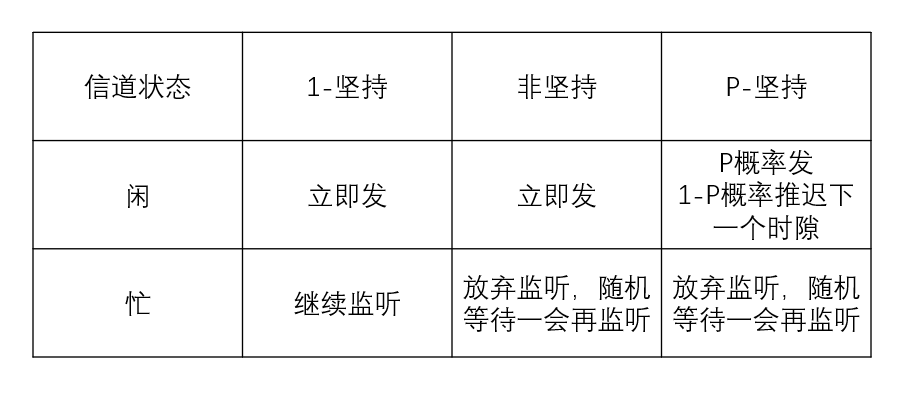
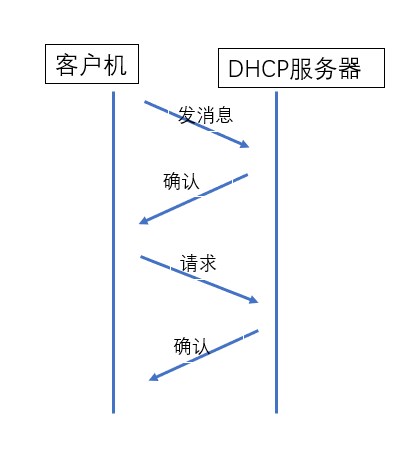
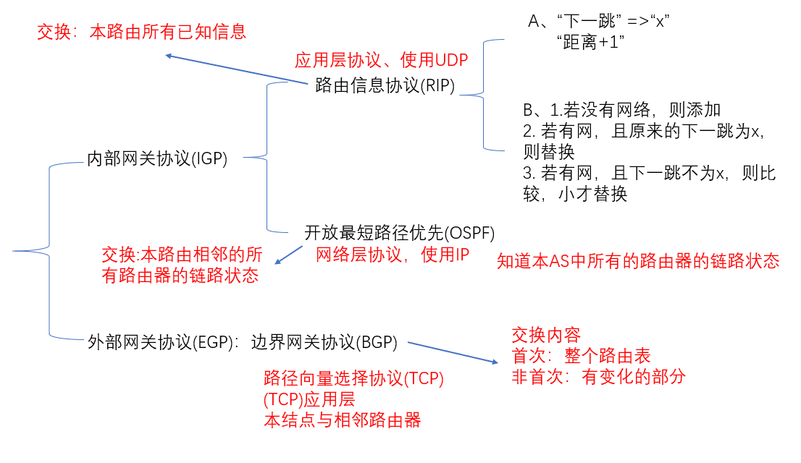
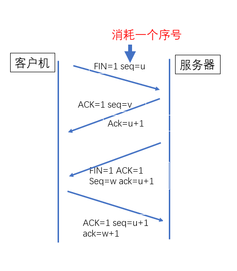
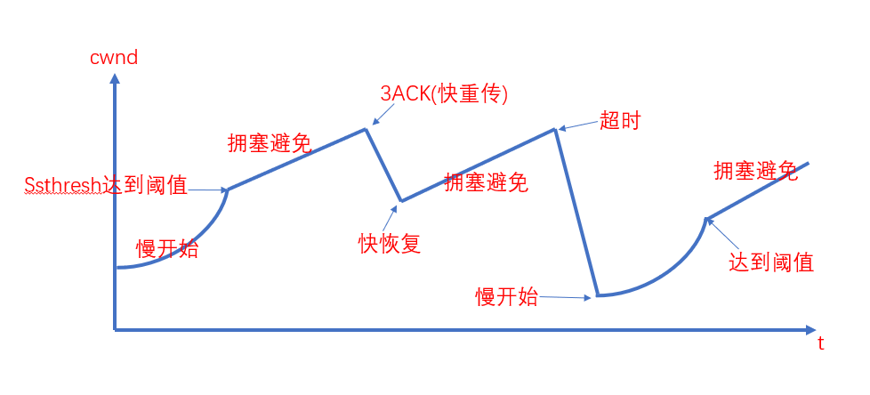
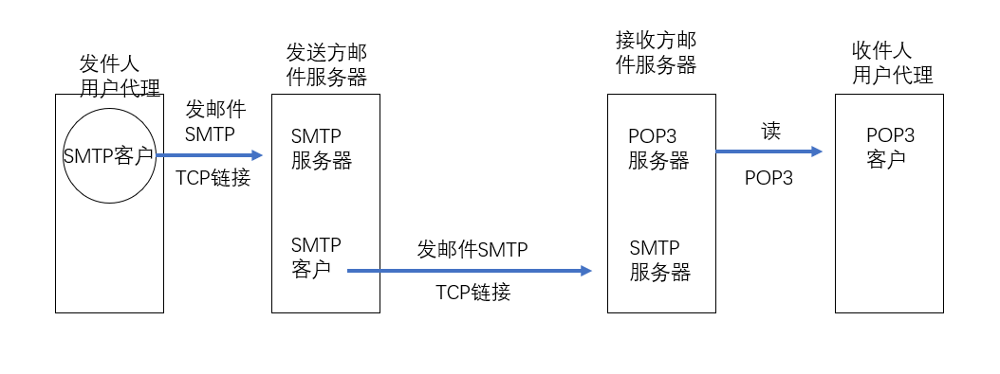

# 概述

## OSI 参考模型

- 应用层：用户与网络的界面，为应用程序提供访问 ISO 的手段
- 表示层：数据解密加密、压缩、格式转换
- 会话层：会话管理和同步
- 传输层：流量控制、差错控制、服务质量、数据传输管理
    - 报文段(TCP)
    - 用户数据报(UDP)
- 网络层：流量控制、拥塞控制、差错控制、网际互连(分组、数据报)
- 数据链路层：成帧、差错控制、流量控制、传输管理(帧)
- 物理层：透明传输比特流(比特)

在ISO/OSI中，网络层支持面向链接和非链接
而在TCP/IP中，则是在传输层

<!-- more -->

# 物理层

1. 基带信号： 数字信号 ==> 数字信道(近距离)
   宽带信号： 基带信号 ==> 模拟信号 ==> 模拟信道(远距离)
2. M Baud的码元传输率(若是一码元包含n bit信息量) ==> 数据传输率：M·n bit/s 
3. 奈奎斯特定理：(理想条件下)
    $极限数据传输率 = 2Wlog_2V$
4. 香农定理：(有噪声的条件下)
    $极限数据传输率=Wlog_2{(1+S/N)}$
    $信噪比=10log_{10}{(S/N)}$
    - $当S/N=10时，信噪比为10dB$
    - $当S/N=100时，信噪比为30dB$
5. 编码：
    - 曼彻斯特编码：1下0上
    - 差分曼彻斯特编码：1同0异
6. 调制：
    $f_{采样频率} \geq 2f_{信号最高频率}$
    
    - ASK(调幅)
    - FSK(调频)
    - PSK(调相)
    - QAM(正交振幅)

    $若波特率为B，m个相位，n个振幅，则R=Blog_2{(m*n)}$

7. 存储转发交换：
    - 电路交换(不提供差错控制)
    - 报文交换(长度无限制，只适用于数字信号)
    - 分组交换(有长度限制)
        - 数据报方式
        - 虚电路方式

8. 传输介质：(不属于物理层)

    - 导向型
        - 双绞线
            1. 屏蔽
            2. 非屏蔽
        - 同轴电缆
        - 光纤
            1. 多模
            2. 单模
    - 非导向型
        - 无线电波
        - 微波
            - 地面微波接力通信
            - 卫星通信
        - 红外、激光

9. 接口特性：

- 机械特性：规格、引线数、引脚数、排列情况
- 电气特性：信号的电压高低、阻抗匹配、传输速率、距离限制
- 功能特性：电平电压表示的意义、信号线的用途
- 规程特性：工作规程、时序关系

10. 物理层设备:(不分割冲突域)

- 中继器(转发器)：再生数字信号
    - “5-4-3”规则
    - 无存储转发功能，协议相同，速率相同

- 集线器:多端口中继器

# 数据链路层

## 问题与对应的方案 

1. 重复帧 ==> 帧编号
2. 帧丢失 ==> 计时器超时重传
3. 差错控制 ==> 校验码

## 差错控制：

1. 奇偶校验码
只检查奇数个比特错误，检错能力50%

2. 循环冗余码:(CRC)
    - 异或：相同为0，相异为1
    - 多项式n位，阶为n-1
    - 步骤：
        - 通过多项式判断阶数n
        - 数据加上n个0
        - 数据除以多项式
        - 异或相除，得余数即为FCS
        - 发送：数据+FCS

3. 海明码：(第一位为一号)(从左往右)
发现双比特错，纠正单比特错

- 海明不等式：
$2^r \geq K+r+1 (r为冗余信息位，K为信息位)$

- 纠错d位，码距则需要2d+1
  检错d位，码距则需要d+1

- 编码为2的幂的位是检验位

    $P_1 \bigoplus D_1 \bigoplus D_2 \bigoplus D_4$
    $P_2 \bigoplus D_1 \bigoplus D_3 \bigoplus D_4$
    $P_3 \bigoplus D_2 \bigoplus D_3 \bigoplus D_4$

## 介质访问控制

### 信道划分

- 频分复用(FDM)
用于模拟信号，类似于"并行"

- 时分复用(TDM)
用于数字信号，类似于"并发"

- 波分复用(WDM)
"光的频分复用"

- 码分复用(CDM)：1=>1 、-1 => 0 
    - $S$为A站的码片向量
      $T$为B站的码片向量
      则$S·T=0$
    - 合并$(S, T)$
    - 分离，取A：
      $S(S, T)· \frac{1}{|S(S, T)|}$

### 随机访问

1. Aloha协议
    - 不进行任何检测就发，想发就发
    - 一段时间内未收到$ack$，则意味着发生冲突
    - 过一段再发

2. 间隙Aloha协议
    - 只有在时间片开始才能发送

3. CSMA(先听再发)

4. CSMA/CD(总线型，半双工)

- 发的时候还在监听
- $ \tau$为单程传播时延，$2\tau$称为争用期
- **最小帧长=$2 \tau * 数据传输率$**
- 以太网规定：$2\tau=51.2\mu s$
  因此$10Mb/s  ==> 64B最小帧长$
- 指数退避 $K = min[重传次数， 10] $
  重传次数小于16，$[0, 1 ...,2^k-1]$,取一个$r$ ==> $t=2r \tau$

5. CSMA/CA
先广播告诉其他结点，在某一段时间内不要发送数据

## 广域网协议

### PPP协议
- 面向字节
- 结构
    - 链路控制协议LCP
    - 网络控制协议NCP
    - 一个将IP数据报封装到串行链路的方法
- 信息段 0~1500 字节
- 有差错检测，但无纠错，不使用序号和确认机制
- 仅点对点，仅全双工
- 两种模式
    - 异步线路：字节填充法
    - 同步线路：比特填充法

### HDLC协议

- ISO制定，不属于TCP/IP协议簇
- 面向比特
- 全双工
- 0比特插入法，5 "1" 1 "0"
- 站
    - 主站
    - 从站
    - 复合站
- 数据操作方式
    - 正常响应
    - 异步平衡
    - 异步响应
- 帧类型
    - 信息帧
    - 监督帧
    - 无编号帧
- 使用编号和确认机制，提供可靠传输

### 轮询访问

- 令牌传递
- 不产生冲突，占全部带宽
- 易发生单点故障

## 设备

- 物理层：
    - 中继器：基带(以太网)
    - 放大器：带宽
- 数据链路层：
    - 网桥
    - 交换机

# 网络层

## IPV4 

- A类(1~126) ===> 1 ===> 126
- B类(128~191) ===> 128.1 ===> 191.255
- C类(192~223) ===> 192.0.1 ===> 223.255.255
- D类(224~239)
- E类(240~255)

## 网络地址转换NAT

将专用网络地址转换为公用地址 ===> {ip: 端口}

## CIDR

IP地址/网络前缀所占比特数
- 指派地址数(除了本地测试与全网广播)：$2^N-2$
- 最长前缀匹配
- 构造超网/路由聚合

## ARP协议

IP -> MAC映射

- ARP工作在网络层
- NAT工作在传输层

## DHCP(动态主机配置协议)

- 用于给主机动态分配IP地址
- 应用层协议，基于UDP
- 广播方式进行交互

## ICMP(网际控制报文)

- 主机或者路由器报告差错和异常情况
- ICMP是IP层协议(网络层)
- PING工作在应用层，使用网络层的ICMP
    Traceroute/tracert工作在网络层

## 路由协议

## IP组播
(IGMP协议)(224.0.0.0 ~ 239.255.255.255)

- 基于UDP,尽最大努力交付 
- 组播地址，只用于目的地址
- 不产生ICMP差错报文
- 并非所有D类地址都可以作为组播地址
- IP的后23位与MAC地址后23位对应，而MAC前(48-23)=25位中第25位为0

## 移动IP

- 当移动结点跑到其他网络(外部代理)时，要向本来的网络(本地代理)注册一个转交地址
- 本地代理就会为这个转交地址弄个隧道，当收到信息都会从这个隧道发过去

# 传输层

## 概述

套接字 = (主机IP， 端口号)
唯一标识了网络中的一个主机和其上的一个应用

- TCP: 全双工可靠的逻辑信道(FTP、HTTP、远程登录TELNET)
- UDP: 在IP之上仅附加了
    - 多路复用
    - 数据的错误检查
    
基于UDP的协议：TFTP(小文件传输)、DNS、SNMP(简单网络管理协议)、RTP(实时协议)

## UDP协议：
- 首部仅8B开销
- 面向报文，不可分割
- 可靠性在应用层完成
- 二进制反码运算求和取反
  不为偶数个字节需要填入一个全0字节

## 熟知端口

## TCP
- 面向字节流
- 首部长度 20~60字节
    - 数据偏移为4位，因此一位为4B单位

## 流量控制

### 流量控制手段

- 数据链路层：接收方收下就不回确认
- 传输层：接收方给发送方一个窗口公告

### 滑动窗口

- 停-等协议：
发送窗口 = 1，接收窗口 = 1
- 后退N帧：
发送窗口 > 1，接收窗口 = 1
- 选择重传：
发送窗口 > 1，接收窗口 > 1

### 自动重传请求(ARQ)

- 停-等协议
    - 只需要1bit来编码
- 后退N帧(GBN)
    - 重传的是出错的帧以及随后N个帧
    - 接收方只允许按顺序接收帧
    - 可使用累计确认
    - 接收窗口为1
      发送窗口为$1 \leq W_t \leq 2^n-1$(采用n比特编号) 
- 选择重传(SR)
    - **数据帧逐一确认，收一个确认一个**(即不是按序接收的，不累积确认)
    - 只重传出错帧
    - 接收方有缓存
    - $W_R + W_T  \leq 2^n$
      $又因为W_R \leq 2^(n-1)$
      $所以W_{Tmax} = W_{Rmax} = 2^{n-1} $

## 信道利用率

$信道利用率 = \frac{T_D}{T_D + RTT + T_A} = \frac{L/C}{T}$

$其中，L为T内发送Lbit数据，C为发送方数据传输率，T为发送周期(T_D+RTT+T_A)$

$信道吞吐率= 信道利用率*发送方的发送速率$

## TCP链接的建立和释放

### 建立链接

### 释放链接

## 拥塞控制

# 应用层

- P2P模型(所有计算机都对等)
- C/S模型
- DNS系统
    - 递归查询
    - 迭代查询
        - 根域名服务器
        - 顶级域名服务器
        - 授权域名服务器(将主机名转换成IP地址)

    www.abc.xyz.com(最多查询4次)
- FTP服务器
    - 控制链接(21端口)：一直开启
    - 数据链接(20端口，服务器的)：只有在传数据时打开
    - 主进程：接收请求
    - 从属进程：处理单个请求

- 电子邮件

Hotmail、Gmail在浏览器用HTTP，在不同邮件服务器之间才用SMTP
POP3在传输层使用明文密码

- 万维网www
    - URL：<协议>://<主机>:<端口>/<路径>
    - HTTP:80TCP端口，无状态，无连接(虽然用了TCP)
    - 对非持久链接：文档传输时间=2RTT+传输时间

