## 前言
最近看了侯捷老师关于C++的课——《C++: 面向高级对象编程（上）》，感觉收益匪浅，醍醐灌顶，因此将课程中学到的一些比较重要的内容整理出来。

## 基于对象(Object Based)的程序设计

### 不带有指针成员变量的类——以复数类complex为例

#### 头文件的结构


由上图可知，头文件的结构一般包含以下四个部分：

- 防卫式声明(guard)：防止头文件被重复包含
- 前置声明(forward declarations): 声明头文件中用到的类和函数
- 类声明(class declarations): 声明类的函数和变量
- 类定义(class definition): 实现前面声明的函数

#### 访问级别

在 C++ 中包含三种访问级别：
- private： 只能被**本类中的函数**访问
- protected： 能被**本类的函数**和**子类的函数**访问
- public: 可以被**所有函数**访问

<!-- more -->

``` C++

class complex {
    public:
        complex(double r=0, double i=0) : re(r), im(i) {}
        complex& operator += (const complex&);
        double real() const {return re;}
        double imag() const {return im;}
    private:
        double re, im;

    friend complex& __doapl(complex*, const complex&);
}

```

类的声明内可以交叉定义多个不同级别的访问控制块

### 函数设计

#### 内联函数

在类声明内定义的函数将自动转换为`inline`函数
在类声明以外定义的函数，需要加上`inline`关键字

``` C++

inline double imag(const complex& x) {
    return x.imag();
}

```
#### 构造函数

构造函数可以使用默认实参，并且采用列表初始化(initialization list)


#### 常量成员函数

如果类中的成员函数不会改变成员变量，则应当加上`const`关键字

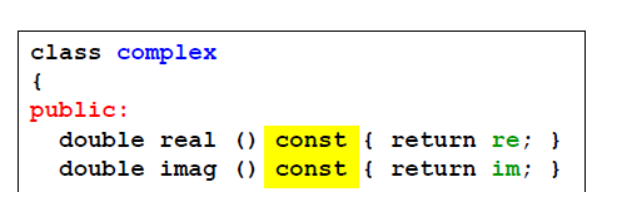

若这类函数不加以const修饰,则常量对象将不能调用这些函数

#### 参数按值传递和按引用传递


按引用传递可以节约内存，提高传递效率

为了避免传入的参数在函数体内被修改，可以使用`const`关键字修饰传入的参数

#### 返回值的值传递与引用传递


为提高效率,若函数的返回值是原本就存在的对象,则应以引用形式返回

若函数的返回值是临时变量,则只能通过值传递返回

#### 友元函数

友元函数不受访问级别的控制，可以自由访问对象的所有成员

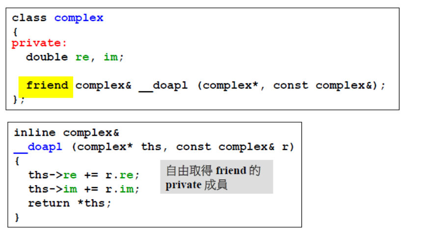

同一类的各个对象互为友元函数，因此在类定义内可以访问其他对象的私有变量


### 操作符重载

C++操作符重载有两种形式

- 在类内声明`public`函数实现操作符重载，此时操作符作用在左操作数上
- 在类外声明全局函数实现操作符重载

例如使用两种方式对操作符`+`重载

``` C++
complex c1;
c1 + 2; 

// case1:
complex::operator += (int)
// case2:
complex operator + (const complex&, double)

```
#### 在类内声明public函数重载 +=

    complex::operator += (const complex& r)

输入参数和输出参数均使用引用传值,输入参数在函数中不应被改动,因此使用`const`修饰

输出参数类型为`complex&`,这是为了支持将多个`+=`操作符串联起来

若返回参数类型设为`void`,也支持形如`c2+=c1`的运算,但不支持形如`c3+=c2+=c1`的运算


函数体内调用友元函数`__doapl(complex *, const complex &)`第一个参数接收成员函数内隐含的`this`指针,其内容在函数中会被改变
第二个参数接收重载函数的参数,该参数在函数中不会被改变,以`const`修饰.

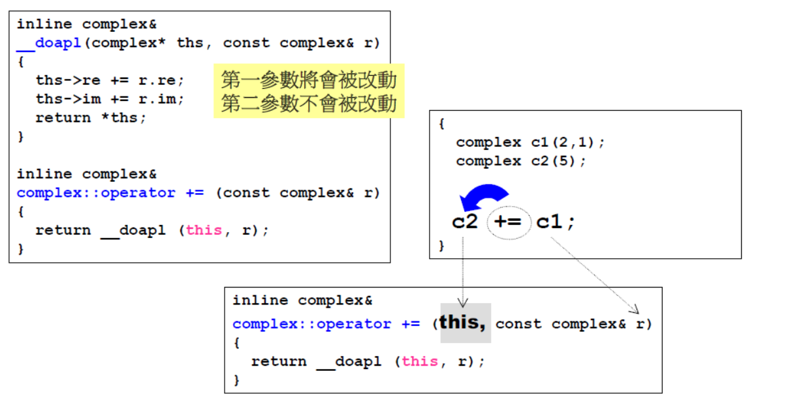

引用传递参数和返回值的好处在于传送者无需知道接收者是否以引用形式接收,只需要和值传递一样写代码就行,不需要改动

#### 在类内声明或函数重载 +


因为重载操作符的成员函数是作用在左操作数上的,若使用类内声明`public`函数重载操作符的方法,就不能支持第3种用法了
因此使用在类外声明函数重载`+`运算符

这3个函数返回的是局部对象(local object),在退出函数时对象就会被销毁,因此不能使用引用传递返回值

#### 在类外声明函数重载 <<


与重载+的考虑方法类似,<<操作符通常的使用方式是`cout<<c1`而非`c1<<cout`,因此不能使用成员函数重载`<<`运算符

考虑到形如`cout<<c1<<c2<<c3`的级联用法,重载函数的返回值为`ostream&`而非`void`

### 总结代码编写的注意事项

- 构造函数中使用列表初始化为成员函数赋值
- 常量成员函数用`const`修饰
- 参数的传递尽量考虑使用按引用传递，若函数体内修改传入的参数，则应当加上`const`修饰
- 返回值若非局部变量，其传递尽量考虑使用引用传递
- 数据放入`private`中，大部分函数放入`public`中

## 带有指针的成员变量的类——以字符串String为例

String类定义在头文件string.h中,其结构与complex.h类似

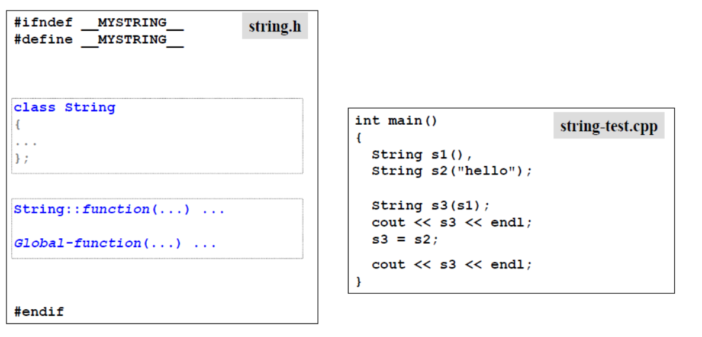

类声明如下,使用指针成员变量m_data管理String类中的字符串数据

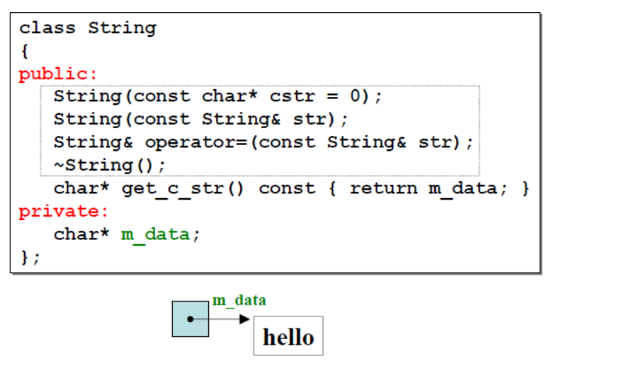

### 三种特殊函数

- 拷贝构造函数
- 拷贝赋值函数
- 析构函数

对于不带有指针的类,这3个函数可以使用编译器默认为我们生成的版本;但是编写带有指针的类时就有必要定义这3个特殊函数

#### 构造函数和析构函数

构造函数和析构函数中执行数据的深拷贝和释放

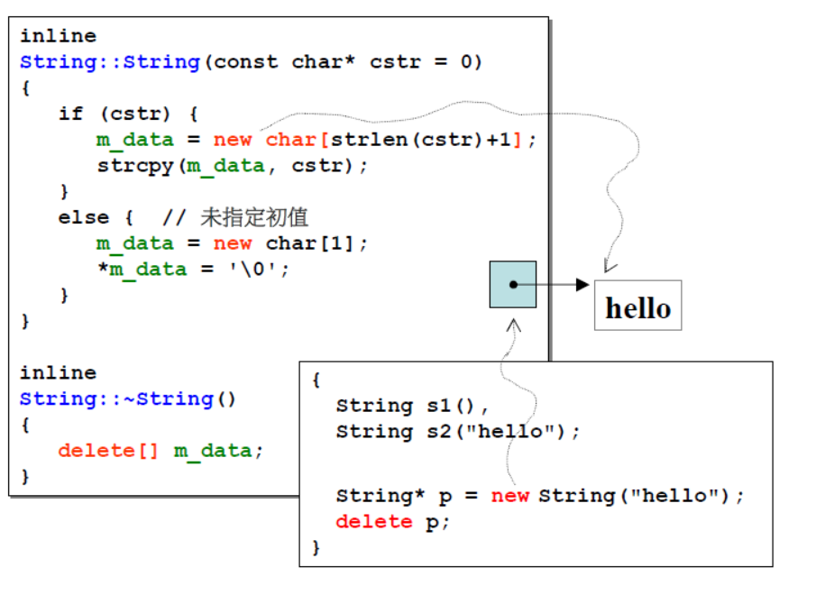

值得注意的是使用`delete[]`操作符释放数组内存,若直接使用`delete`操作符释放数组内存虽然能够通过编译,但有可能产生内存泄漏

#### 拷贝构造函数和拷贝赋值函数

拷贝构造函数和拷贝赋值函数的使用场景不同，下面这个例子中，拷贝3虽然使用了`=`赋值，但是由于在初始化过程中使用的，所以调用的是拷贝构造函数

``` C++
String s1 = "hello";
String s2(s1);        // 拷贝一： 调用拷贝构造函数
String s3;
s3 = s1;              // 拷贝二： 调用拷贝赋值函数
String s4 = s1;       // 拷贝三： 调用拷贝构造函数
```

拷贝构造函数可以直接调用友元对象的数据指针进行拷贝来实现

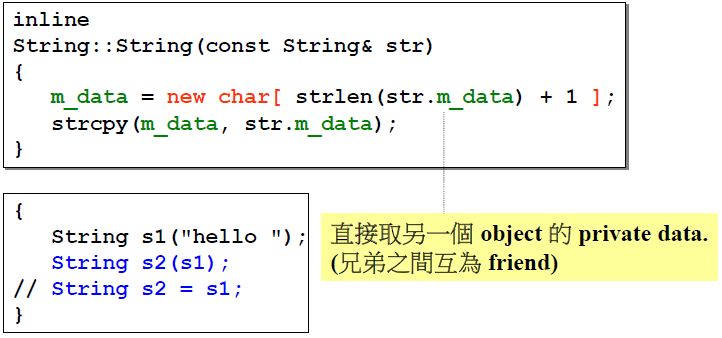

拷贝赋值函数中要检测自我赋值，不仅是为了考虑效率，也是为了防止出现BUG

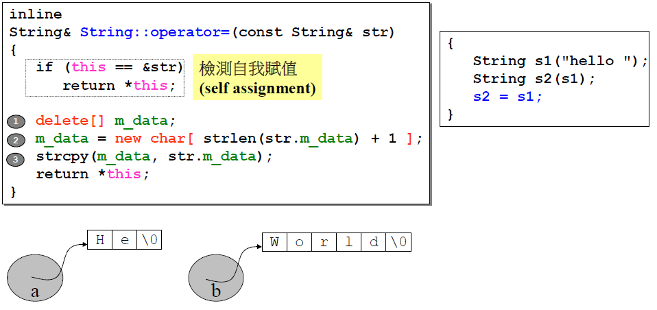

如果拷贝赋值函数中不检测自我赋值，在第二步中会出现BUG


### 堆栈与内存管理

#### 堆栈及对象的生命周期

栈(stack),是存在于某作用域(scope)的一块内存空间
当你调用函数,函数本身就会形成一个stack用来记录它所接收的参数以及返回地址.在函数本体内声明的任何变量,其所使用的内存块都取自上述stack

堆(heap),是指由操作系统提供的一块global内存空间,程序可动态分配从其中获得若干区块


- stack object的生命周期

        class Complex{...};
        // ...
        {
            Complex c1(1, 2);
        }

    程序中c1就是stack object，其生命周期在作用域(大括号)结束的时候结束
    这种作用域内的对象又叫作 auto object，因为它会被自动清理

- static object的生命周期

        class Complex { … };
        // ...
        {
        static Complex c2(1,2);
        }

    程序中c2就是static object,其生命周期在作用域(大括号)结束之后仍然存在,直到整个程序结束

- global object的生命周期

        class Complex { … };
        // ...
        Complex c3(1,2);
        int main()
        {
        ...
        }

    程序中c3就是global object,其生命在在整个程序结束之后才结束,也可以将其视为一种static object,其作用域是整个程序

- heap object的生命周期

        class Complex { … };
        // ...
        {
        Complex* p = new Complex;
        // ...
        delete p;
        }

    程序中p指向的对象就是heap object,其生命周期在它被deleted之际结束.若推出作用域时忘记delete指针p则会发生内存泄漏,即p所指向的heap object 仍然存在,但指针p的生命周期却结束了,作用域之外再也无法操作p指向的heap object.

#### `new` 和 `delete` 过程中的内存分配

- `new`操作**先分配内存，再调用构造函数**


- `delete`操作**先调用构造函数，再释放内存**


对于带有指针的`String`类,`new`和`delete`的操作如下：

|  new   | delete  |
|  :----:  | :----:  |
| 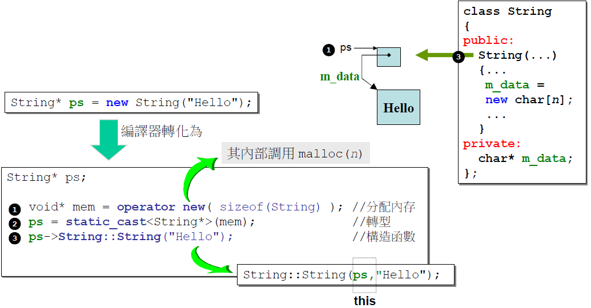  | 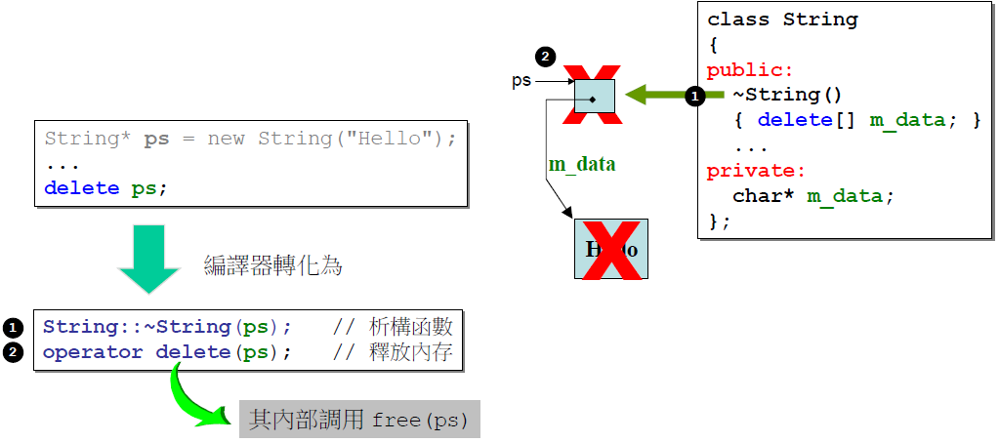 |

VC中对象在`debug`模式和`release`模式下的内存分布如下图所示,变量在内存中所占字节数必须被补齐为16的倍数,红色代表`cookie`保存内存块的大小,其最低位的`1`和`0`分别表示内存是否被回收

| Complex对象 | String对象 |
| :----: | :----: |
| 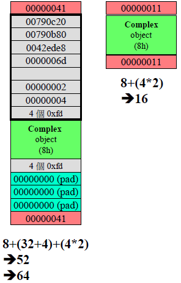 |  |

数组中的元素是连续的,数组头部4个字节记录了数组长度:

| Complex对象 | String对象 |
| :----: | :----: |
|  | 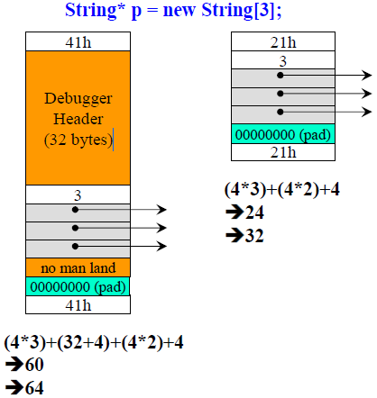 |

根据数组在内存中的状态,自然可以理解为什么new[]和delete[]应该配对使用了: delete操作符仅会调用一次析构函数,而delete[]操作符依次对每个元素调用析构函数.对于String这样带有指针的类,若将delete[]误用为delete会引起内存泄漏

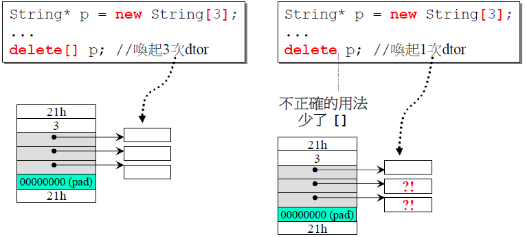

## static 成员

对于类来说,`non-static`成员变量每个对象均存在一份,`static`成员变量和`static`成员函数在内存中仅存在一份
其中`non-static`成员函数通过指定this指针获得函数的调用权,而`static`函数不需要this指针即可调用

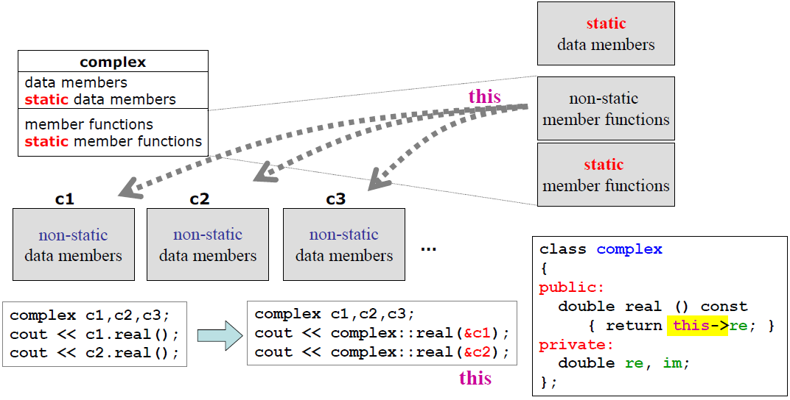

`static`成员函数可以通过对象调用,也可以通过类名调用

``` C++
class Account {
public:
    static double m_rate;
    static void set_rate(const double& x) { m_rate = x; }
};
double Account::m_rate = 8.0;

int main() {
    Account::set_rate(5.0);
    Account a;
    a.set_rate(7.0);
}
```

`static`成员变量需要在类声明体外进行初始化

# 面向对象(Object Oriented)的程序设计————类之间的关系

类之间的关系有复合(composition)、委托(aggregation)和继承(extension)3种

## 类之间得关系

### 复合(composition)

复合表示一种`has-a`的关系,STL中`queue`的实现就使用了复合关系.这种结构也被称为**adapter模式**


复合关系下构造由内而外,析构由外而内:
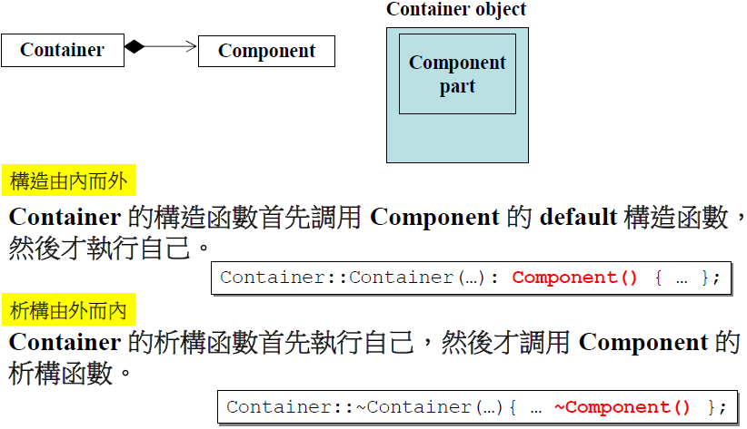

### 委托(aggregation; composition by reference)

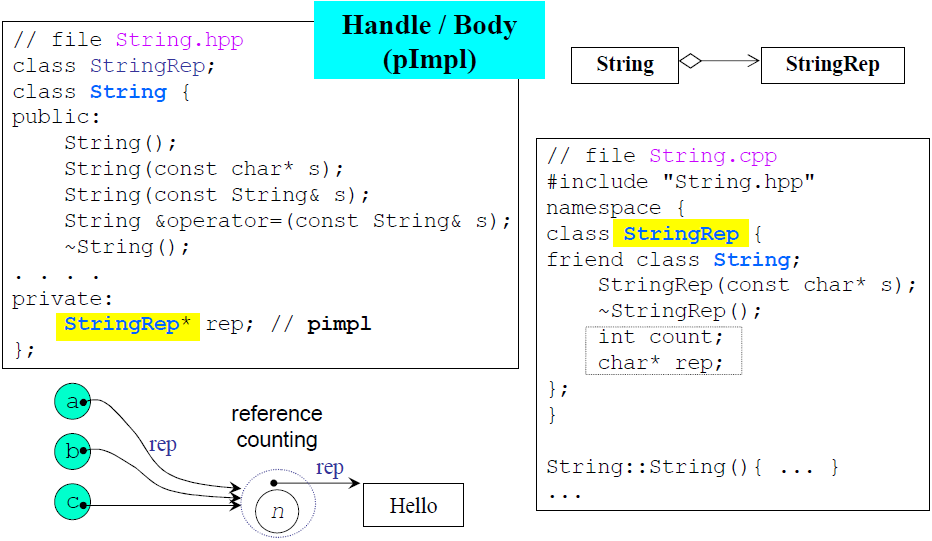

委托将类的定义与类的实现分隔开来,也被称为**编译防火墙**

### 继承(extension)

继承表示一种`is-a`的关系,STL中`_List_node`的实现就使用了继承关系

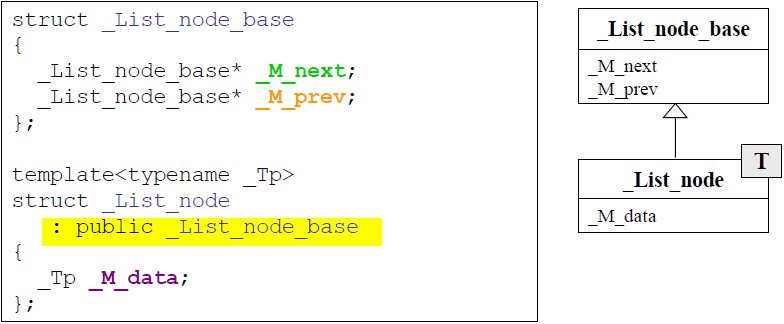

继承关系下构造由内而外,析构由外而内:

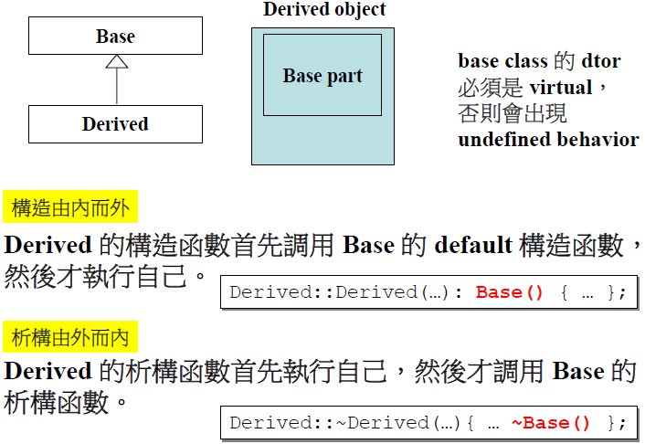

#### 虚函数

成员函数有3种: 非虚函数、虚函数和纯虚函数

- 非虚函數(non-virtual function): 不希望子类重新定义(override)的函数

- 虚函數(virtual function): 子类可以重新定义(override)的函数,且有默认定义

- 纯虚函數(pure virtual function): 子类必须重新定义(override)的函数,没有默认定义

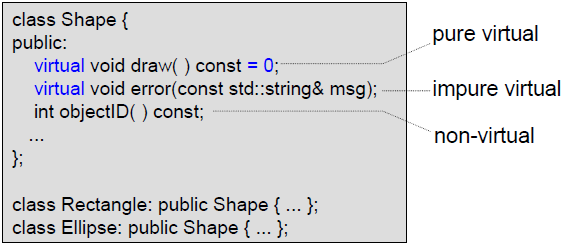

使用虚函数实现框架: 框架的作者想要实现一般的文件处理类,由框架的使用者定义具体的文件处理过程,则可以用虚函数来实现

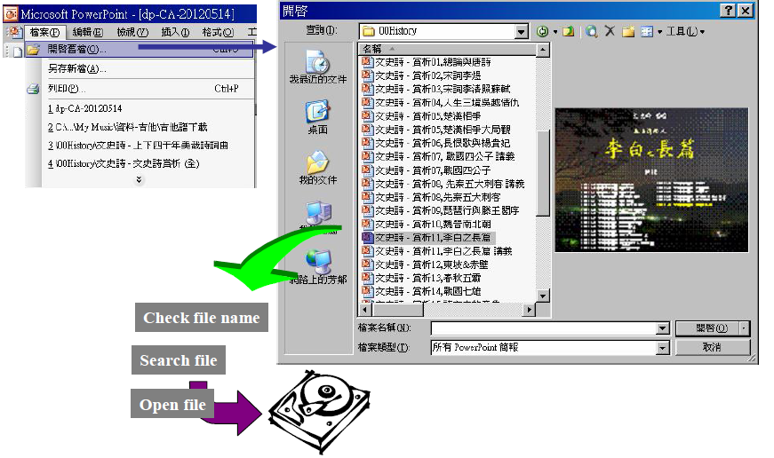

将框架中父类`CDocument`的`Serialize()`函数设为虚函数,由框架使用者编写的子类`CMyDoc`定义具体的文件处理过程,流程示意图和代码如下:

| 流程示意图 | 代码 |
| :----: | :----: |
|  |  | 

## 面向对象设计范例

### 使用委托+继承实现Observer模式

使用Observer模式实现多个窗口订阅同一份内容并保持实时更新


类结构图如下:


### 使用委托+继承实现Composite模式

使用Composite模式实现多态,类结构图如下


### 使用委托+继承实现Prototype模式

Prototype模式示意图如下:


